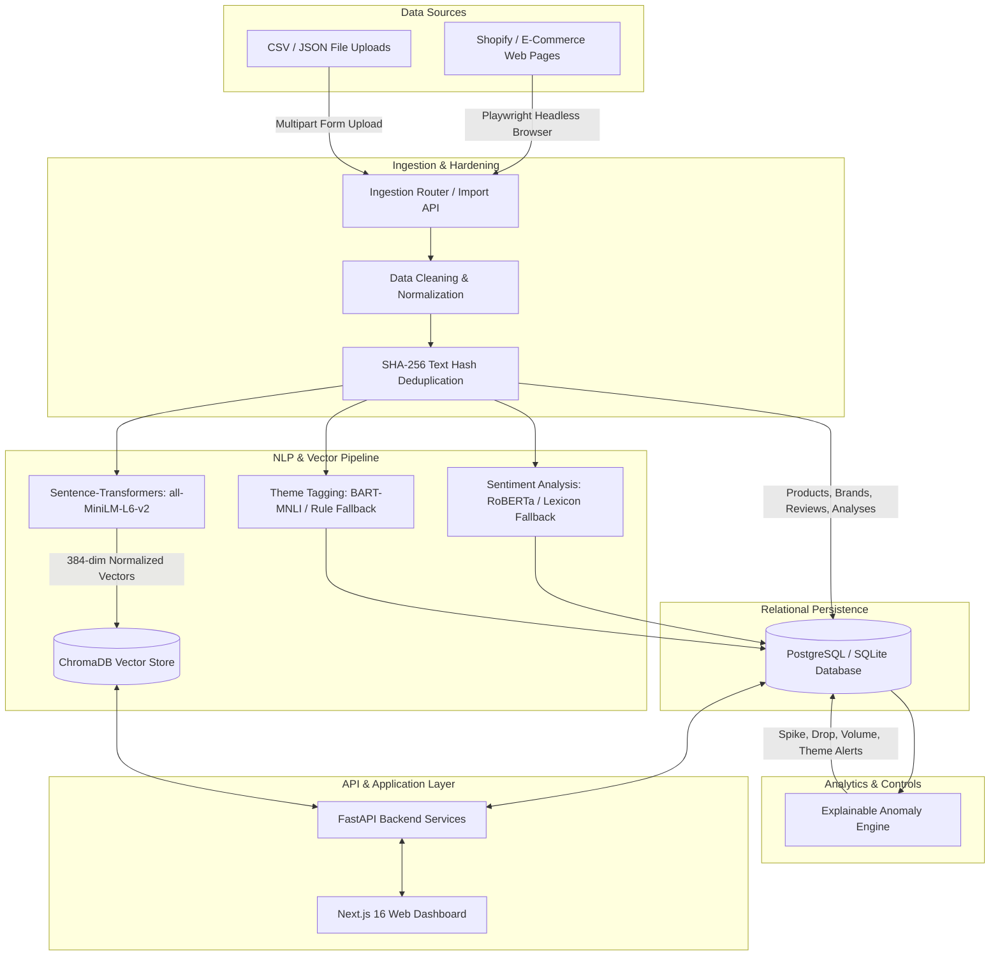

# MarketPulse

**E-commerce Intelligence & Consumer Analytics Platform**

MarketPulse is an end-to-end intelligence and consumer analytics platform designed for direct-to-consumer (D2C) and e-commerce wellness brands. The system automates multi-source customer review ingestion (via headless web scraping, Shopify integrations, and CSV/JSON imports), cleans and deduplicates feedback, runs an NLP enrichment pipeline for sentiment scoring and zero-shot theme extraction, indexes reviews into a ChromaDB vector space using local transformer embeddings (`all-MiniLM-L6-v2`), and executes an explainable statistical anomaly detection engine to surface operational exceptions with underlying review evidence.

---

## Key Capabilities

* **Multi-Source Review Ingestion**: Ingest customer reviews via Playwright headless browser scrapers (Shopify and custom review widgets) or structured multipart CSV/JSON uploads.
* **Cleaning & Normalization**: Strips HTML tags, decodes Unicode entities, cleans control characters, standardizes multiple date formats, parses currency notations, and filters out non-substantive text.
* **Cryptographic Deduplication**: Computes deterministic SHA-256 review text hashes scoped by product to guarantee zero duplicate reviews across ingestion cycles.
* **Sentiment Analysis**: Evaluates customer sentiment polarity and confidence scores with Hugging Face RoBERTa models and a local keyword-frequency fallback.
* **Zero-Shot Theme Tagging**: Classifies reviews across 9 key consumer themes (`efficacy`, `taste/flavor`, `price/value`, `shipping/delivery`, `packaging`, `side effects`, `ingredient quality`, `customer service`, `subscription`).
* **Real Semantic Embeddings**: Generates 384-dimensional float embeddings using `sentence-transformers/all-MiniLM-L6-v2` with singleton caching and unit L2-normalization.
* **Vector Semantic Search**: Queries ChromaDB using cosine distance space (`hnsw:space: "cosine"`) with calibrated relevance scoring $[0.0, 1.0]$ and relational joins to full SQL review records.
* **Explainable Anomaly & Control Engine**: Detects negative sentiment spikes, rating deterioration, review volume surges/cliffs, theme complaint spikes, and product-level deviations with mathematical thresholds, human-readable explanations, and review ID evidence links.
* **Statistical Safeguards**: Enforces strict minimum data requirements ($N \ge 6$ reviews) and outputs an explicit `insufficient_data` state to prevent false-positive anomaly alerts.
* **Interactive Next.js Dashboard**: Visualizes brand metrics, sentiment trends, theme breakdowns, side-by-side brand comparisons, vector search with filter pills, and anomaly exception feeds with review drill-downs.
* **Dual Database Compatibility**: Runs seamlessly on local in-memory/file SQLite (`aiosqlite`) for development and PostgreSQL 16 (`asyncpg`) for containerized deployment.
* **Automated Test Coverage**: Backed by 62 automated unit and integration tests across data pipelines, embeddings, anomalies, and REST endpoints.

---

## Architecture



---

## Technology Stack

| Layer | Technologies & Dependencies | Purpose |
| :--- | :--- | :--- |
| **Frontend** | Next.js 16.2 (App Router), React 19, TypeScript, Vanilla CSS Modules, Recharts | Interactive web analytics dashboard, data visualization, and search interface |
| **Backend** | Python 3.11, FastAPI 0.115, Pydantic v2, Uvicorn | High-performance asynchronous REST API, data validation, and pipeline coordination |
| **ORM & Migrations** | SQLAlchemy 2.0 (async), Alembic 1.14, aiosqlite, asyncpg | Unified asynchronous database modeling supporting both PostgreSQL and SQLite |
| **Vector Storage** | ChromaDB (remote HttpClient & local persistent Client) | Nearest-neighbor vector indexing and cosine distance semantic retrieval |
| **AI / NLP Models** | `sentence-transformers` (all-MiniLM-L6-v2), `transformers`, `torch` | 384-dimensional dense semantic embeddings; zero-shot classification; sentiment scoring |
| **Data Ingestion** | Playwright (headless Chromium), BeautifulSoup4, lxml | Dynamic web scraping of e-commerce storefronts and customer review widgets |
| **DevOps & Infra** | Docker, Docker Compose, Alpine Linux | Containerized multi-service deployment (PostgreSQL, ChromaDB, FastAPI, Next.js) |
| **Testing** | pytest 9.1, pytest-asyncio, httpx, aiosqlite StaticPool | Asynchronous unit, integration, and evaluation benchmark testing (62 automated tests) |

---

## Data Pipeline

The MarketPulse data pipeline processes raw text into structured analytical insights and searchable vector representations through nine distinct stages:

```text
Raw Source (Web/File)
       ↓
1. Ingestion         → Parses raw HTML structures or multipart CSV/JSON payloads.
       ↓
2. Cleaning          → Removes HTML tags, standardizes unicode, normalizes whitespace, rejects reviews < 5 chars.
       ↓
3. Normalization     → Standardizes dates to YYYY-MM-DD and prices to float values.
       ↓
4. Deduplication     → Computes SHA-256 hash of product ID + cleaned text; skips duplicate records.
       ↓
5. Sentiment         → Evaluates text polarity (positive, neutral, negative) and confidence score [0.0, 1.0].
       ↓
6. Theme Tagging     → Maps review content to 9 standardized consumer themes.
       ↓
7. Embedding         → Encodes review text into a 384-dimensional unit vector using all-MiniLM-L6-v2.
       ↓
8. Dual Persistence  → Writes relational entities to PostgreSQL/SQLite and embeddings with metadata to ChromaDB.
       ↓
9. Control Engine    → Compares current period metrics against baseline to surface explainable anomaly alerts.
```

---

## Semantic Search & Vector Retrieval

MarketPulse implements true semantic search over customer reviews using local sentence transformers rather than keyword matching or mock vectors.

* **Model**: `sentence-transformers/all-MiniLM-L6-v2`
* **Vector Dimension**: 384 dimensions (float32 vectors, L2 unit normalized).
* **Distance Metric**: Cosine distance space configured via ChromaDB collection metadata `{"hnsw:space": "cosine"}`.
* **Calibrated Relevance**: ChromaDB returns cosine distance $d = 1 - \cos(\theta) \in [0, 2]$. Distances are clamped to $[0.0, 1.0]$, producing an accurate semantic relevance percentage: $\text{Relevance} = (1.0 - d) \times 100\%$.
* **Lifecycle & Caching**: The transformer model is loaded once as an in-memory singleton. Model loading attempts local file loading first to guarantee zero network latency during queries.
* **Reindexing Mechanism**: `POST /search/reindex` or `reindex_all_reviews()` queries all existing reviews from the relational database and synchronizes them into the ChromaDB collection with associated metadata (`review_id`, `product_id`, `brand_id`, `sentiment`, `rating`).

### Retrieval Benchmark

The repository includes a 20-query evaluation benchmark suite ([backend/app/evaluation/retrieval_benchmark.py](file:///d:/E/projects/MarketPulse/backend/app/evaluation/retrieval_benchmark.py)) covering core wellness review themes (efficacy, taste/flavor, digestive side effects, shipping delays, packaging damage, price/value, etc.).

On the seeded reference dataset:
* **Benchmark Size**: 20 representative customer queries.
* **Top-$K$**: $K = 5$.
* **Mean Precision@5**: **0.61** (61% of top-5 retrieved items match query theme and sentiment criteria).
* **Mean Recall@5**: Evaluated relative to relevant candidate items identified within the retrieved ranking pool. Unconstrained recall metrics require exhaustive manual corpus labeling across all documents.

---

## Explainable Anomaly / Control Engine

MarketPulse features a deterministic, explainable statistical control engine ([backend/app/pipeline/anomalies.py](file:///d:/E/projects/MarketPulse/backend/app/pipeline/anomalies.py)) that identifies meaningful operational regressions and shifts without opaque black-box machine learning models.

### Implemented Controls

| Control Type | Metric Tracked | Baseline Period | Detection Logic | Alert Threshold | Severity |
| :--- | :--- | :--- | :--- | :--- | :--- |
| **Negative Sentiment Spike** | % Negative Reviews | Prior 50% chronological reviews | Compares current period negative ratio against baseline ratio | $\ge +15$ percentage points | `critical` |
| **Rating Deterioration** | Average Star Rating | Prior 50% chronological reviews | Measures drop in average rating between baseline and current | $\ge -0.50$ stars | `critical` |
| **Review Volume Anomaly** | Review Ingestion Rate | Prior 50% chronological reviews | Ratio of current review volume to baseline volume | $\ge 2.5\times$ surge or $\le 0.35\times$ cliff | `warning` |
| **Theme Complaint Spike** | Theme Negative % | Prior 50% chronological reviews | Negative review percentage for a specific theme (e.g. `packaging`) | $\ge +15$ percentage points | `warning` |
| **Product Anomaly** | Product vs Brand Rating | Entire brand review baseline | Measures deviation between product average and brand benchmark | $\ge \pm 0.80$ stars | `info` |
| **Insufficient Data** | Review Count ($N$) | Total reviews available | Flags brands with too few reviews for statistical baseline validity | $N < 6$ reviews | `info` |

### Explainability Standard

Every anomaly generated contains:
1. **Metric Name**: Explicit identifier (e.g., `negative_sentiment_percentage`, `average_rating`).
2. **Baseline Value**: Precise historical benchmark figure (e.g., `21.4%`).
3. **Current Value**: Recent period metric figure (e.g., `42.9%`).
4. **Deviation**: Exact calculated delta (e.g., `+21.5 pp`).
5. **Human-Readable Text**: e.g., *"Negative sentiment spiked from 21.4% to 42.9% (+21.5 pp), exceeding the 15.0 pp threshold."*
6. **Supporting Evidence**: An array of relational `review_id`s that triggered the anomaly, allowing direct drill-down into source customer feedback.

---

## Dashboard Walkthrough

The web dashboard is organized into specialized analytical pages:

* **Overview (`/dashboard`)**: Displays cross-brand operational KPIs, tracked brand cards with average star ratings and review counts, top discussion themes, and an inline CSV/JSON ingestion panel.
* **Brand Detail (`/dashboard/brands/[id]`)**: Comprehensive deep dive for a selected brand. Features weekly sentiment trend area charts, horizontal theme breakdown bars with sentiment scores, and a paginated review feed filterable by sentiment and rating.
* **Brand Comparison (`/dashboard/compare`)**: Side-by-side metric comparison across two or more brands evaluating average ratings, total review volume, positive sentiment ratios, and top competitive strengths/weaknesses.
* **Insights & Anomalies (`/dashboard/insights`)**: The central control feed. Includes a "Detect Anomalies Now" action button, feed tabs (All Insights, Anomalies Only, General Trends), severity filter dropdown, metric comparison cards (Baseline, Current, Deviation, Threshold), and an embedded drill-down drawer to view supporting reviews.
* **Semantic Search (`/dashboard/search`)**: Real-time vector search interface allowing natural language queries (e.g., *"stomach cramps nausea"* or *"packaging damaged"*). Displays matched reviews ranked by calibrated relevance percentages with brand and sentiment filter pills.
* **Settings (`/dashboard/settings`)**: Displays connection status to FastAPI backend, active database dialect, vector database host/port, environment configurations, and webhook status.
* **Authentication Pages (`/sign-in`, `/sign-up`)**: User onboarding screens demonstrating authentication layouts and interactive state transitions.

---

## API Reference

FastAPI exposes an asynchronous REST API documented interactively at `/docs` (Swagger UI) and `/redoc`:

### Health
* `GET /health`: Returns system liveness status `{"status": "ok"}`.

### Brands
* `GET /brands`: List all tracked brands.
* `GET /brands/{id}`: Detailed brand record with aggregate statistics (total products, reviews, average rating).
* `GET /brands/{id}/products`: List all catalog products under a brand.
* `GET /brands/{id}/reviews`: Paginated review records (`product_id`, `sentiment`, `rating`, `limit`, `offset`).
* `GET /brands/{id}/sentiment-trend`: Chronological sentiment trend aggregated by week.
* `GET /brands/{id}/themes`: Theme breakdown with mention counts and average sentiment scores.

### Data Ingestion
* `POST /brands/import`: Multipart form upload accepting CSV or JSON files. Ingests products and reviews, executes cleaning, deduplication, sentiment analysis, theme tagging, and vector embedding in a single pass.
* `POST /brands/{brand_id}/scrape`: Triggers asynchronous web scraper for a registered brand URL.

### Search & Vector Operations
* `GET /search`: Semantic search over reviews via ChromaDB cosine similarity. Accepts `q` (min 2 chars), `brand_id`, `sentiment`, and `limit`. Returns ranked reviews with calibrated `relevance` scores $[0.0, 1.0]$.
* `POST /search/reindex`: Batch reindexes all reviews in the relational database into ChromaDB.

### Insights & Controls
* `GET /insights`: Retrieve generated insights and anomaly alerts. Supports filtering by `brand_id`, `product_id`, `type`, `severity`, `status`, `is_anomaly`, and `limit`.
* `POST /insights/detect-anomalies`: Runs the statistical anomaly detection engine over all brands or a specific `brand_id` and writes explainable control exceptions to the database.

### Compare
* `GET /compare`: Side-by-side comparison across multiple brand IDs (e.g. `?brand_ids=1&brand_ids=2`).

### Organization & Watchlist
* `GET /me`: Current user / organization profile.
* `GET /watchlist`: List followed brands in watchlist.
* `POST /watchlist/{brand_id}`: Add a brand to the user's watchlist.
* `DELETE /watchlist/{brand_id}`: Remove a brand from the watchlist.

### Webhooks
* `POST /webhooks/clerk`: Svix-verified webhook endpoint for syncing external Clerk user events.

---

## Data Sources

MarketPulse includes ingestion adapters for consumer wellness brands:

* **Decode Age**: Longevity & cellular health supplements (NMN, Resveratrol, Spermidine).
* **Kapiva**: Ayurvedic health and nutrition formulations (Ashwagandha, Shilajit, Juices).
* **OZiva**: Plant-based clean nutrition and organic protein supplements.
* **Custom CSV Uploads**: Structured review files containing columns for product name, review text, rating, author, and date.
* **Custom JSON Uploads**: Nested JSON schemas mapping products to arrays of customer review objects.

> [!NOTE]
> Web scrapers rely on Playwright and CSS/JSON selector patterns tailored for Shopify stores and review widgets (e.g., Judge.me, Loox, Yotpo). E-commerce storefront layouts and anti-scraping defenses evolve; scraper selector configurations require periodic maintenance.

---

## Database Architecture

MarketPulse supports both local SQLite and containerized PostgreSQL through SQLAlchemy asynchronous sessions:

```text
┌─────────────────┐       ┌─────────────────┐
│     Brand       │◄──────┤     Product     │
│─────────────────│1     *│─────────────────│
│ id              │       │ id              │
│ name            │       │ brand_id (FK)   │
│ url             │       │ name, price     │
└────────┬────────┘       └────────┬────────┘
         │1                        │1
         │                         │
         │*                        │*
┌────────▼────────┐       ┌────────▼────────┐
│     Insight     │       │     Review      │
│─────────────────│       │─────────────────│
│ id              │       │ id              │
│ brand_id (FK)   │       │ product_id (FK) │
│ product_id (FK) │       │ raw_text        │
│ type, severity  │       │ cleaned_text    │
│ status, metric  │       │ rating          │
│ baseline_value  │       │ review_date     │
│ current_value   │       │ text_hash (UQ)  │
│ deviation       │       └────────┬────────┘
│ threshold       │                │1
│ text            │                │
│ supporting_ids  │       ┌────────▼────────┐
└─────────────────┘       │ ReviewAnalysis  │
                          │─────────────────│
                          │ id              │
                          │ review_id (FK)  │
                          │ sentiment       │
                          │ sentiment_score │
                          │ themes (JSON)   │
                          │ embedding_id    │
                          └─────────────────┘
```

Database migrations are managed via Alembic (`backend/alembic`).

---

## Automated Testing

The backend test suite is built on `pytest` and `pytest-asyncio` using an in-memory SQLite database configured with `StaticPool` for complete test isolation.

### Test Breakdown (62 Tests Total)

* **Data Cleaning & Normalization (`tests/unit/test_cleaning.py`)**: 9 tests covering HTML stripping, whitespace normalization, control characters, short review rejection, date parsing, price parsing, language filtering, and product cleanup.
* **Deduplication (`tests/unit/test_deduplication.py`)**: 4 tests verifying identical text hashing, cross-product collision resistance, and duplicate rejection.
* **Sentiment Analysis (`tests/unit/test_sentiment.py`)**: 5 tests validating positive, negative, and neutral sentiment classification, stable schema output, and model-absence fallback.
* **Theme Tagging (`tests/unit/test_themes.py`)**: 5 tests validating keyword matching, side effects detection, packaging/shipping themes, fallback defaults, and output format.
* **Insight Rules (`tests/unit/test_insights.py`)**: 4 tests verifying positive/negative trend threshold triggering, mention minimums, and JSON theme parsing.
* **Semantic Embeddings (`tests/unit/test_embeddings.py`)**: 5 tests verifying singleton model initialization, 384-dimensional vector output, ChromaDB indexing, cosine semantic search, and metadata filtering.
* **Retrieval Benchmark (`tests/unit/test_retrieval_benchmark.py`)**: 3 tests verifying query dataset format, hit relevance logic, and Precision@K/Recall@K math.
* **Anomaly Detection Engine (`tests/unit/test_anomalies.py`)**: 5 tests covering negative sentiment spikes, rating deterioration, theme complaint spikes, stable metrics without alerts, and insufficient data guardrails.
* **API Endpoints (`tests/integration/test_api_endpoints.py`)**: 14 tests verifying health checks, brand queries, product listings, review pagination, sentiment trends, theme breakdown, brand comparison, insight listing, and semantic search.
* **Import API (`tests/integration/test_import_api.py`)**: 5 tests verifying CSV/JSON uploads, empty payload rejection, validation rules, and end-to-end pipeline ingestion.
* **Anomaly API & Search Admin (`tests/integration/test_anomalies_api.py`)**: 3 tests verifying `POST /insights/detect-anomalies`, anomaly filtering flags, and `POST /search/reindex`.

Run the complete test suite:
```bash
cd backend
pytest tests -v
```

---

## Local Setup & Quick Start

### Prerequisites
* Python 3.11+
* Node.js 18+ (Node 20+ recommended)
* npm / npx
* (Optional) Docker & Docker Compose

---

### Option A — Local Development (SQLite + Fast Startup)

#### 1. Backend Setup
```bash
cd backend
python -m venv .venv

# On Windows:
.venv\Scripts\activate
# On Linux/macOS:
source .venv/bin/activate

# Install dependencies
pip install -r requirements.txt

# Seed sample brands, products, and reviews into local SQLite
python seed.py
python seed_brands.py

# Launch FastAPI development server
uvicorn app.main:app --reload --port 8000
```
FastAPI Swagger documentation will be available at [http://localhost:8000/docs](http://localhost:8000/docs).

#### 2. Frontend Setup
```bash
cd frontend
npm install
npm run dev
```
Open [http://localhost:3000](http://localhost:3000) to view the MarketPulse dashboard.

---

### Option B — Docker Compose (Full Stack with PostgreSQL & ChromaDB)

To spin up the complete containerized environment:

```bash
docker compose up --build
```

Services provisioned:
* **Frontend (Next.js)**: [http://localhost:3000](http://localhost:3000)
* **Backend API (FastAPI)**: [http://localhost:8000](http://localhost:8000)
* **PostgreSQL 16**: `localhost:5432` (database: `marketpulse`)
* **ChromaDB**: `localhost:8100` (mapped to internal port 8000)

---

## Demo Workflow

Follow these steps to evaluate the application end-to-end:

1. **Launch Services**: Start the backend on port 8000 and the frontend on port 3000.
2. **Access Dashboard**: Navigate to [http://localhost:3000/dashboard](http://localhost:3000/dashboard). Review tracked brands (Aura Longevity, Zenith Botanicals, Decode Age).
3. **Ingest Reviews**: Click **Import Data** on the Overview page or use the sidebar Ingest panel to upload a sample CSV containing customer reviews.
4. **Inspect Brand Deep Dive**: Click on any brand card (e.g., *Aura Longevity*) to view the weekly sentiment trend graph, theme breakdown, and filtered reviews.
5. **Run Vector Semantic Search**: Navigate to **Search** in the sidebar. Search for *"stomach pain nausea"* or *"delayed courier delivery"*. Note the real-time relevance percentage calculation and review matches.
6. **Detect Anomalies**: Navigate to **Insights & Anomalies**. Click **Detect Anomalies Now**. Observe explainable anomaly cards populated with baseline, current value, deviation delta, and human-readable reasoning.
7. **Drill Down into Evidence**: Click **View Supporting Reviews** on any anomaly card to inspect the exact customer feedback that caused the alert.
8. **Compare Brands**: Navigate to **Compare Brands**. Select two or more brands to evaluate head-to-head performance.

---

## Known Limitations & Honest Disclosures

* **Frontend Authentication**: The dashboard currently operates in open developer mode with simulated authentication state transitions. Production Clerk JWT validation infrastructure is present in the backend middleware (`backend/app/middleware/clerk_auth.py`), but full end-to-end Clerk session enforcement on frontend routes is intentionally deferred to avoid blocking local developer setups.
* **Initial Model Weight Retrieval**: When running on a fresh environment without pre-cached Hugging Face models, the sentence-transformer (`all-MiniLM-L6-v2`) requires an initial ~80MB weight download. Subsequent runs operate strictly offline from local cache.
* **Web Scraper Selector Maintenance**: E-commerce website DOM structures and Shopify themes change over time. Scrapers in `backend/app/scraping/` may require selector updates if target websites modify their review widget markup.
* **Historical Baseline Window**: Statistical anomaly detection compares recent reviews against the earlier 50% chronological split of available reviews. For brands with fewer than 6 reviews, the engine safely halts and reports an `insufficient_data` alert rather than computing misleading statistics.

---

## Repository Structure

```text
MarketPulse/
├── .env.example                     # Root environment variable template
├── .gitignore                        # Git ignore rules for Python, Node, and secrets
├── README.md                         # Comprehensive platform documentation
├── docker-compose.yml                # Multi-container orchestration definition
│
├── backend/
│   ├── .env.example                  # Backend environment template
│   ├── Dockerfile                    # Container definition for FastAPI backend
│   ├── alembic.ini                   # Alembic database migration config
│   ├── requirements.txt              # Python package dependencies
│   ├── seed.py                       # Sample database seed script
│   ├── seed_brands.py                # Reference brand catalog seed script
│   ├── test_api.py                   # Lightweight smoke test verification script
│   │
│   ├── alembic/                      # Database migrations
│   │   ├── env.py                    # Migration execution environment
│   │   └── versions/                 # Versioned migration revisions
│   │
│   ├── app/                          # Core application code
│   │   ├── main.py                   # FastAPI initialization & router mount
│   │   ├── config.py                 # Pydantic BaseSettings configuration
│   │   ├── database.py               # Async SQLAlchemy engine and session setup
│   │   │
│   │   ├── models/                   # SQLAlchemy database models
│   │   │   ├── brand.py              # Brand entity
│   │   │   ├── product.py            # Product entity
│   │   │   ├── review.py             # Customer review entity
│   │   │   ├── analysis.py           # Review sentiment & theme analysis entity
│   │   │   ├── insight.py            # Insights and anomaly control entity
│   │   │   └── auth.py               # User and organization models
│   │   │
│   │   ├── pipeline/                 # Data processing & intelligence pipeline
│   │   │   ├── cleaning.py           # Text cleaning and data normalization
│   │   │   ├── sentiment.py          # Sentiment classification with fallback
│   │   │   ├── themes.py             # Zero-shot theme tagging with fallback
│   │   │   ├── embeddings.py         # Sentence-transformers & ChromaDB vector ops
│   │   │   ├── enrich.py             # Batch enrichment coordinator
│   │   │   ├── insights.py           # Trend and rule-based insights
│   │   │   └── anomalies.py          # Explainable statistical anomaly detection engine
│   │   │
│   │   ├── evaluation/               # Benchmark suites
│   │   │   └── retrieval_benchmark.py# 20-query semantic retrieval benchmark
│   │   │
│   │   ├── routers/                  # FastAPI REST endpoints
│   │   │   ├── brands.py             # Brand catalog & metrics
│   │   │   ├── import_data.py        # CSV/JSON ingestion & scraping triggers
│   │   │   ├── search.py             # Vector semantic search & reindexing
│   │   │   ├── insights.py           # Insights listing & anomaly triggers
│   │   │   ├── compare.py            # Cross-brand comparisons
│   │   │   ├── org.py                # User profile & watchlist management
│   │   │   └── webhooks.py           # Clerk webhook receiver
│   │   │
│   │   ├── scraping/                 # Headless browser scraping modules
│   │   │   ├── base.py               # Base scraper interface
│   │   │   ├── decode_age.py         # Decode Age specific scraper
│   │   │   ├── other_brands.py       # Kapiva and OZiva scrapers
│   │   │   └── run_scrape.py         # Scraper CLI runner
│   │   │
│   │   └── schemas/                  # Pydantic request/response schemas
│   │
│   └── tests/                        # Automated test suite (62 tests)
│       ├── conftest.py               # Isolated in-memory SQLite fixtures & clients
│       ├── unit/                     # Unit test modules
│       │   ├── test_cleaning.py
│       │   ├── test_deduplication.py
│       │   ├── test_sentiment.py
│       │   ├── test_themes.py
│       │   ├── test_insights.py
│       │   ├── test_embeddings.py
│       │   ├── test_anomalies.py
│       │   └── test_retrieval_benchmark.py
│       └── integration/              # Integration test modules
│           ├── test_api_endpoints.py
│           ├── test_import_api.py
│           └── test_anomalies_api.py
│
└── frontend/
    ├── .env.example                  # Frontend environment template
    ├── Dockerfile                    # Multi-stage production container build
    ├── package.json                  # Next.js dependencies & scripts
    ├── tsconfig.json                 # TypeScript compiler configuration
    ├── next.config.ts                # Next.js configuration
    │
    ├── public/                       # Static public assets (SVGs, icons)
    │
    └── src/
        ├── app/                      # Next.js App Router pages
        │   ├── page.tsx              # Landing page
        │   ├── layout.tsx            # Global HTML & font layout
        │   ├── globals.css           # Global CSS variables & tokens
        │   ├── sign-in/              # Sign-in authentication route
        │   ├── sign-up/              # Sign-up authentication route
        │   └── dashboard/            # Authenticated analytics dashboard
        │       ├── page.tsx          # Overview dashboard
        │       ├── layout.tsx        # Dashboard sidebar & header layout
        │       ├── brands/[id]/      # Brand detail & sentiment trends
        │       ├── compare/          # Cross-brand comparative matrix
        │       ├── insights/         # Anomaly exception feed & review drill-down
        │       ├── search/           # Vector semantic search interface
        │       └── settings/         # System settings & integration status
        │
        ├── components/               # Reusable UI & chart components
        │   ├── layout/               # Header and Sidebar components
        │   ├── charts/               # Recharts wrappers (trends, sparklines, themes)
        │   └── ui/                   # Logo, IngestPanel, animated background
        │
        └── lib/                      # Utilities & API client
            ├── api.ts                # Strongly typed backend API client
            └── theme.ts              # Theme constants & color mappings
```
